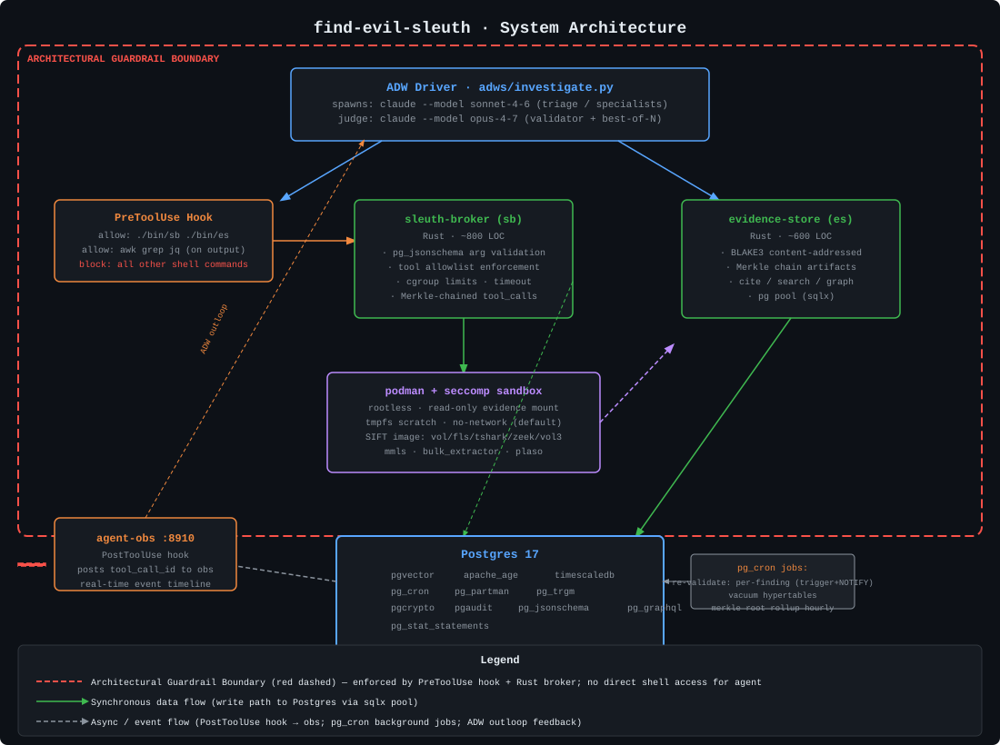

# find-evil-sleuth

> **Autonomous, tamper-proof DFIR on a Postgres substrate — from raw evidence to cited report without a human in the loop.**

## What it is

find-evil-sleuth is a Level-5 agentic digital-forensics and incident-response (DFIR) system built for the SANS "FIND EVIL!" hackathon. Three specialist subagents (disk, memory, network) run the full SIFT toolchain autonomously, each producing `findings` rows in Postgres that carry a BLAKE3-hashed artifact chain, a Merkle-chained audit trail, and an Apache AGE attack graph. A validator subagent re-executes every claim against the original evidence; an IR-narrator subagent turns confirmed findings into a structured report with `[F-NNN]` citations.

The architectural guardrail is not a system prompt — it is a Bash `PreToolUse` hook that exits 1 on any command other than `./bin/sb` (sleuth-broker) or `./bin/es` (evidence-store), enforced at the Claude Code hook layer before the shell sees the command. The Rust broker behind `./bin/sb` validates tool arguments via `pg_jsonschema`, runs each forensic binary in a rootless podman container with a custom seccomp profile and read-only evidence mount, and streams stdout/stderr directly into Postgres. No agent can escape to raw shell, network, or the host filesystem.

The substrate is Postgres 17 with eleven extensions (pgvector, Apache AGE, TimescaleDB, pg_cron, pg_partman, pg_trgm, pgcrypto, pg_stat_statements, pgaudit, pg_jsonschema, pg_graphql). Every tool invocation is a row. Every artifact is content-addressed. `./bin/es cite F-001` returns the complete provenance chain — tool call, arguments, exit code, stderr, BLAKE3 hash, artifact content — in under 100 ms. Judges can run live `SELECT` queries during the demo.

## Quick Start

```bash
# 1. Clone and start the substrate
git clone https://github.com/wilaroca2021/find-evil-sleuth
cd find-evil-sleuth
docker compose -f docker/compose.yaml up -d

# 2. Fetch the SANS LoneWolf evidence (downloads ~2 GB from digitalcorpora.org)
./scripts/fetch-evidence.sh ./cases/lone-wolf/

# 3. Run the full investigation (triage → specialists → validator → narrator)
./scripts/investigate.sh ./cases/lone-wolf/

# 4. Cite any finding — full provenance chain in <100 ms
./bin/es cite F-001
```

`investigate.sh` drives the complete ADW pipeline: triage classifies evidence, three specialists run in parallel, the validator re-executes every claim, the narrator emits `report.md` inside your case directory. Estimated wall time on an 8-core/32 GB VM: 20–40 minutes for the full LoneWolf dataset.

## Architecture



The red dashed boundary marks the **architectural guardrail**: the `PreToolUse` hook blocks every command that does not match `./bin/sb` or `./bin/es`. The broker validates, sandboxes, and records. The evidence-store hashes, chains, and exposes. No agent touches the host shell directly.

```
ADW driver (adws/investigate.py)
    │
    ├── PreToolUse hook ──► blocks anything not ./bin/sb or ./bin/es
    │
    ├── ./bin/sb exec --tool <name> --args <json>
    │       │  validates args (pg_jsonschema)
    │       │  podman run --read-only --security-opt seccomp=sleuth.json
    │       └──► tool container (sleuthkit / vol3 / tshark / zeek / …)
    │
    └── ./bin/es cite|record-finding|search|graph
            └──► Postgres 17
                  pgvector · AGE · TimescaleDB · pg_cron · pgaudit · …
```

## Judging Criteria → Design

| # | Criterion | How we address it |
|---|-----------|-------------------|
| 1 | **Autonomous Execution Quality** | ADW outloop + best-of-N narrator (Opus judge); pg_cron re-validates findings hourly without human input; self-correction loop bounded to 3 retries per finding |
| 2 | **IR Accuracy** | Validator subagent re-runs every claim via the broker; `validation_status` ∈ {confirmed, refuted, inconclusive, drift}; pgvector cosine dedup collapses repeat IOC findings |
| 3 | **Breadth × Depth** | Three deep specialists with the full SIFT toolchain: sleuthkit + plaso (disk), Volatility 3 (memory), tshark + zeek + suricata with ET-Open rules (network) |
| 4 | **Constraint Implementation** | Architectural guardrail: Bash hook + Rust broker + rootless podman + custom seccomp + read-only evidence mount + `pg_jsonschema` argument validation — not a system prompt |
| 5 | **Audit Trail** | BLAKE3 content-addressed artifacts, Merkle-chained `tool_calls` hypertable, `findings.tool_call_id` FK; `es cite F-NNN` returns full trace in <100 ms; pgaudit logs every `SELECT` |
| 6 | **Usability & Documentation** | One-command quickstart above; architecture SVG; `[F-NNN]` citations in every report paragraph; copy-paste `es cite` examples throughout |

## Plans

Phase-by-phase design rationale lives in [`plans/`](plans/):

| File | Contents |
|------|----------|
| [`00-master-plan.md`](plans/00-master-plan.md) | Win condition, architecture overview, phased build schedule |
| [`01-postgres-substrate.md`](plans/01-postgres-substrate.md) | Full schema, every extension's role, pg_cron jobs, AGE graph, pgvector strategy |
| [`02-broker-design.md`](plans/02-broker-design.md) | Tool spec format, allowlist, podman invocation, seccomp profile |
| [`03-evidence-store-design.md`](plans/03-evidence-store-design.md) | Merkle chain, BLAKE3 layout, `cite` semantics, search/graph endpoints |
| [`04-subagents-and-skills.md`](plans/04-subagents-and-skills.md) | Each agent's tools, system prompt, skill body, success/failure shape |
| [`05-adw-outloop.md`](plans/05-adw-outloop.md) | investigate.py state machine, retry budget, parallelism caps, idempotency |
| [`06-self-correction-demos.md`](plans/06-self-correction-demos.md) | Exact reproduction steps for both self-correction demos |
| [`07-submission-deliverables.md`](plans/07-submission-deliverables.md) | Devpost checklist, README structure, accuracy report template |
| [`08-risk-and-rollback.md`](plans/08-risk-and-rollback.md) | Full risk register with rollback plans and kill-switches |

## License

Apache-2.0 — see [`LICENSE`](LICENSE).

## Citations

Evidence dataset: SANS Digital Forensics "LoneWolf" scenario, distributed via [digitalcorpora.org](https://digitalcorpora.org/) under the terms documented in [`docs/EVIDENCE.md`](docs/EVIDENCE.md).

Forensic toolchain: The Sleuth Kit (Brian Carrier, Apache-2.0), Volatility 3 (Volatility Foundation, Apache-2.0), Zeek (Zeek Project, BSD), Suricata (OISF, GPL-2.0), tshark (Wireshark Foundation, GPL-2.0), plaso (log2timeline project, Apache-2.0).

Postgres extensions: Apache AGE (Apache-2.0), pgvector (MIT), TimescaleDB (TSL/Apache-2.0), pg_cron (PostgreSQL License), pg_jsonschema (Apache-2.0), pgaudit (PostgreSQL License).
